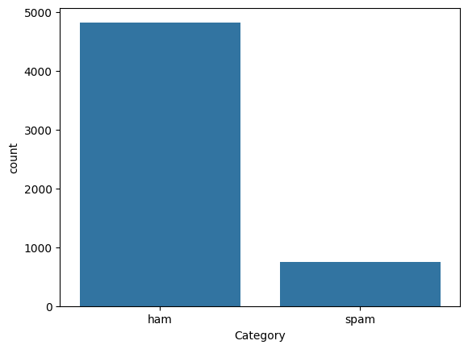

# Laporan Proyek Machine Learning - A Analta Dwiyanto

## Domain Proyek

Penggunaan sosial media sudah menjadi bagian penting dari hidup banyak orang, salah satu media yang sering digunakan ialah E-mail. Namun, email juga sering disalahgunakan untuk menyebarkan spam, yang dapat mengganggu dan membahayakan penggunanya. Spam email dapat berupa iklan yang tidak diinginkan, penipuan phishing, malware, dan konten berbahaya lainnya.

Seiring dengan meningkatnya jumlah pengguna email semakin rentan terjadi kejadian penipuan melalui email spam seperti ini. Oleh karena itu, diperlukan sistem yang dapat mendeteksi spam email dengan akurat dan efisien.

## Business Understanding

Spam email merupakan masalah yang signifikan bagi individu dan organisasi. Spam email dapat merugikan seseorang jika bersifat penipuan atau phising, selain itu email spam dapat menurunkan reputasi seseorang atau sebuah perusahaan, bahkan terdapat kasus dimana email spam tersebut memiliki malware.

### Problem Statements

Berdasarkan potensi bahaya yang disebabkan oleh spam email maka problem statements yang ingin diselesaikan proyek ini adalah

- Bagaimana ciri-ciri email spam?
- Bagaimana membuat model Spam Detection yang akurat dan efisien?

### Goals

Berdasarkan problem statements tersebut, maka Goals dari penelitian ini adalah

- Mengetahui ciri-ciri email spam
- Mengetahui cara membuat model Spam Detection yang akurat dan efisien

## Data Understanding

Pada proyek ini, dataset yang digunakan berasal yaitu Spam Emails dari [Kaggle](https://www.kaggle.com/datasets/abdallahwagih/spam-emails). Dataset ini memiliki 5572 data, dengan 87% data merupakan "ham" dan 13% merupakan "spam", data terdiri dari 2 kolom yaitu

### Variabel-variabel pada Spam Email dataset adalah sebagai berikut

- Messages : Feature, berisi teks dari pesan email.
- Category : Target, merupakan kategori dari pesan email tersebut, terdapat 2 jenis kategori yaitu "ham" atau bukan spam dan "spam".


Gambar 1. Distribusi Data

Pada Gambar 1, dapat dilihat distribusi data diantara kedua kelas 'ham' dan 'spam'

.png)
Gambar 2. Histogram Panjang Message pada Dataset

Gambar 2 menunjukkan panjang message pada dataset pada sumbu X, dan Jumlah message dengan panjang tersebut pada sumbu Y. dapat diamati bahwa rata-rata panjang pesan diantara 1-200 kata, dan terdapat pesan yang panjangnya diatas 800

.png)
Gambar 3. Histogram Panjang Message pada kelas 'Ham' dan 'Spam'

Gambar 3 menunjukkan perbandingan panjang message pada kelas 'Spam' dan 'Ham', dapat diamati bahwa email 'spam' cenderung memiliki panjang pesan rata-rata, sedangkan pesan 'ham' memiliki panjang pesan yang bervariasi bahkan hingga diatas 800

.png)
Gambar 4. Wordcloud message spam

Gambar 4 menunjukkan wordcloud pada message spam, dapat diamati bahwa pesan spam cenderung memberi iming iming hadiah dan membuat urgensi dan menyuruh penerima pesan untuk melakukan sesuatu seperti call, text dan sebagainya

## Data Preparation

Ketika menggunakan PyTorch, Pertama-tama kita perlu mendefinisikan kelas Dataset yang akan kita gunakan, pada projek ini kita membuat kelass SpamDataset yang merupakan ekstensi dari Dataset milik PyTorch

```python
class SpamDataset(Dataset):
    def __init__(self, inputs, labels):
        self.inputs = inputs
        self.labels = labels

    def __len__(self):
        return len(self.inputs)

    def __getitem__(self, idx):
        return {'input_ids': self.inputs[idx], 'labels': self.labels[idx]}
```
Setelah itu dilakukan Label Encoding pada target kita yaitu 'Category', tahap ini dilakukan dengan menggunakan dictionary sederhana dimana kategori 'Ham' akan bernilai 0 dan kategori 'Spam' bernilai 1

Untuk feature kita yaitu 'message', dilakukan Tokenization menggunakan Tokenizer dari kelas `RobertaTokenizer`, kita menggunakan Tokenizer dari `roberta-base`.

Tokenizer ini akan mengubah Teks menjadi `input_ids` lalu data tersebut akan diberikan ke device yang akan kita gunakan pada model

## Modeling

Pada proyek ini, model yang digunakan ialah RoBERTa atau Robustly Optimized BERT Approach, RoBERTa sendiri merupakan model bahasa yang dikembangkan oleh Facebook AI, yang merupakan perluasan dari model BERT (Bidirectional Encoder Representations from Transformers). RoBERTa didasarkan pada arsitektur Transformer dan dilatih dengan pendekatan self-supervised learning.

Proyek ini menggunakan RoBERTa karena beberapa alasan diantaranya:

- Pretrained :  RoBERTa merupakan pretrained language model, pada pretraining nya RoBERTa dilatih menggunakan 160GB data berbahasa inggris yang berasal dari BookCorpus dan Wikipedia.
- Fine-tuning : RoBERTa dapat di fine-tuning pada berbagai downstream task, dengan melatih ulang weights pada RoBERTa sehingga sesuai dengan dataset pada task kita
- State-of-the-art  Performance: RoBERTa mencapai performa state-of-the-art pada berbagai benchmark dalam Natural Language Processing

Untuk menggunakan model RoBERTa untuk Klasifikasi, kita perlu mengimport `RobertaForSequenceClassification` lalu memuat model yang akan kita gunakan ke suatu variabel dengan cara `model = RobertaForSequenceClassification.from_pretrained('roberta-base', num_labels=2)` dimana parameter pertama merupakan nama model nya, lalu `num_labels` adalah parameter untuk menentukan jumlah kelas target kita pada output layer nanti

Setelah model diinisialisasi dan Dataset dan Dataloader kita juga menentukan Optimizer, pada proyek ini kita menggunakan Adam Optimizer. kita juga menentukan hyperparameter batch_size dan num_epoch, pada proyek ini kita menggunakan `batch_size = 32` dan `num_epoch = 5`

Model kemudian di train dengan memasukkan fitur fitur dan juga label nya, namun sebelum itu kita perlu mengubah model menjadi mode train dengan `model.train()`, model kemudian akan menghitung loss untuk setiap batch lalu mengupdate parameter dari model, hal ini akan berlangsung selama jumlah epoch, setelah melalui seluruh epoch, model pun selesai training dan kita lanjut ke tahap evaluation

## Evaluation

Untuk evaluation kita perlu kembali mengubah model ke mode evaluation agar data yang masuk tidak mengupdate parameter dengan `model.eval()`. Pada proyek ini, metrik evaluasi yang digunakan adalah akurasi, precision, recall, dan F1-Score.

Akurasi adalah salah satu metrik evaluasi yang umum digunakan dalam klasifikasi. Akurasi mengukur seberapa sering model melakukan prediksi yang benar dibandingkan dengan total jumlah data yang dinilai.

$$Akurasi = \frac{Jumlah Prediksi Benar}{Total Jumlah Data}$$

Recall adalah salah satu metrik evaluasi yang digunakan untuk mengukur seberapa banyak dari keseluruhan instance positif yang berhasil diidentifikasi oleh model.

$$Recall = \frac{True Positives}{True Positives + False Negatives}$$

- True Positives (TP) adalah jumlah instance positif yang berhasil diidentifikasi dengan benar oleh model.
- False Negatives (FN) adalah jumlah instance positif yang salah diklasifikasikan sebagai negatif oleh model.

Precision adalah metrik evaluasi yang digunakan untuk mengukur seberapa banyak dari instance yang diklasifikasikan sebagai positif oleh model yang benar-benar positif.

$$Precision = \frac{True Positives}{True Positives + False Positives}$$

- False Positives (FP) adalah jumlah instance negatif yang salah diklasifikasikan sebagai positif oleh model.

F1-score adalah metrik evaluasi yang menggabungkan precision dan recall menjadi satu nilai tunggal yang mencerminkan kinerja keseluruhan model. F1-score berguna ketika Anda ingin menyeimbangkan antara precision dan recall

$$F1-Score = 2* \frac{Precision * Recall}{Precision + Recall}$$

Pada tahap evaluasi, model mendapatkan hasil Akurasi:0.99 F1-Score:0.98 Recall:0.98 Precision:0.98, sehingga model tergolong berhasil dan proyek ini mencapai tujuan nya yaitu membuat model deteksi spam dengan akurasi yang tinggi
